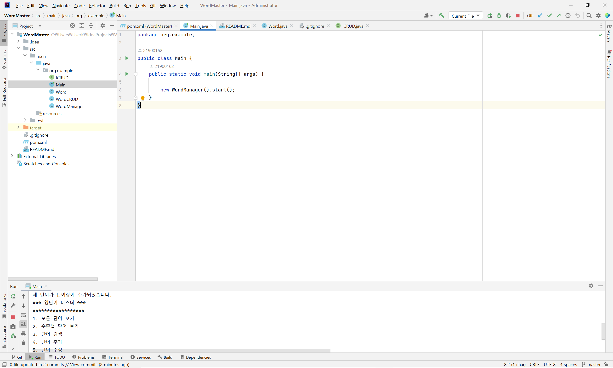
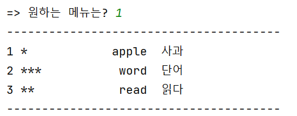
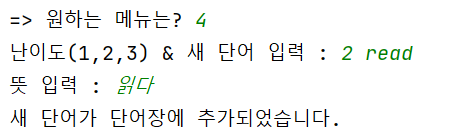
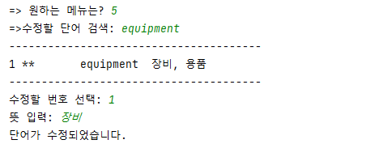
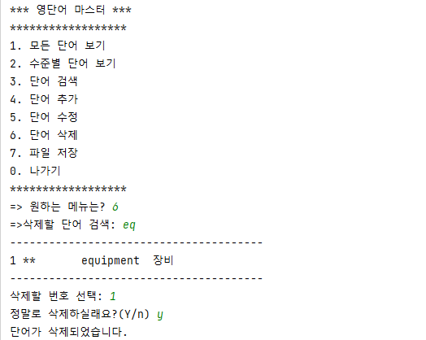

# WordMaster

## 사용한 IDE: IntelliJ

## 기능

- 모든 단어 보기
- 수준별 단어 보기
- 단어 검색
- 단어 추가
- 단어 수정
- 단어 삭제
- 파일 저장
- 나가기

### 1. 모든 단어보기
>

### 2. 수준별 단어보기
>

### 3. 단어검색
>

### 4. 단어추가
>

### 5. 단어수정
>

### 6. 단어삭제
>

### 7. 단어저장
>

### 8. 단어 불러오기
>

### 0. 종료
>

----------------
### * 현재까지 프로젝트를 구현하면서 소감, 어려움, 또는 건의사항

- Word를 위한 class, 관리를 위한 class, interface 만들어 보면서 java의 객체지향 특징을 배울 수 있었다. 
- getter, setter, constructor를 한번에 만들어 주는 툴이 있다는 것을 알 수 있었다.

<2단계>
- File I/O를 사용해보면서 java에는 유용한 class들이 많이 있고 이를 잘 활용해야 함을 느낄 수 있었다. 
- 아직은 스스로 class들 기능별로 나누고 작업하는 점에 있어서 부족함이 있음을 느꼈다. 
- 스스로 다른 CRUD와 File IO에 대해서 공부하고 구현해 보아야 할 것 같다고 느꼈다. 

